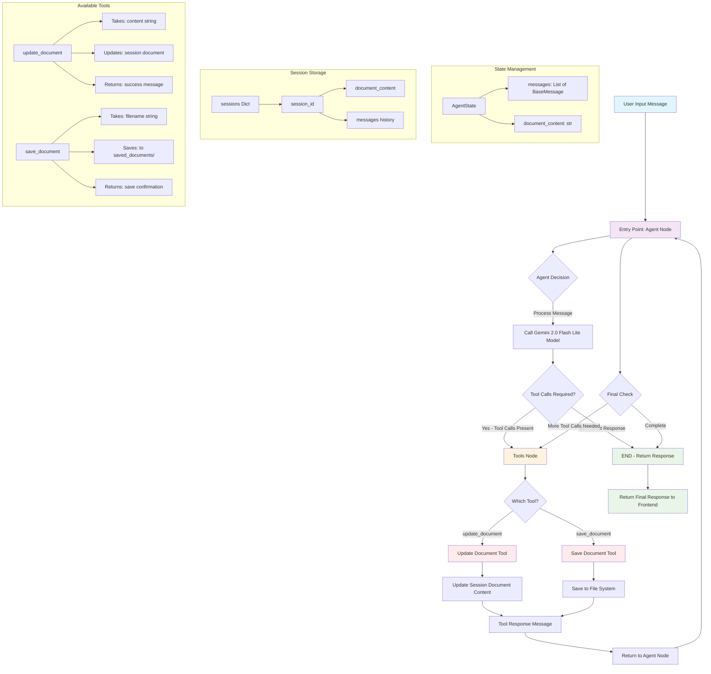

# Drafter - AI-Powered Document Editor

Drafter is an intelligent document editing application that combines a Flask backend with a React frontend to provide an AI-powered writing assistant. Using Google's Gemini AI model and LangGraph, Drafter helps users create, edit, and manage documents through natural language conversations.

## ✨ Features

- **AI-Powered Writing Assistant**: Chat with an AI to create and edit documents
- **Real-time Document Updates**: See your document changes in real-time as you interact with the AI
- **Session Management**: Maintain separate document sessions with unique identifiers
- **Document Persistence**: Save your documents to local files
- **Tool Integration**: AI can use specialized tools to update and save documents
- **Responsive UI**: Modern, gradient-based interface with real-time chat
- **Quick Actions**: Pre-defined buttons for common tasks

## 🛠 Technology Stack

### Backend
- **Flask** - Web framework
- **LangChain** - AI framework for building applications with LLMs
- **LangGraph** - Graph-based workflow orchestration
- **Google Generative AI** - Gemini 2.0 Flash Lite model
- **Flask-CORS** - Cross-origin resource sharing support

### Frontend
- **React** - Frontend framework
- **Lucide React** - Icon library
- **Tailwind CSS** - Utility-first CSS framework
- **Modern JavaScript** - ES6+ features

## 📋 Prerequisites

- Python 3.8+
- Node.js 16+
- npm or yarn
- Google AI API key

## 🚀 Installation & Setup

### Backend Setup

1. **Clone the repository**
   ```bash
   git clone <repository-url>
   cd drafter
   ```

2. **Create and activate virtual environment**
   ```bash
   python -m venv venv
   source venv/bin/activate  # On Windows: venv\Scripts\activate
   ```

3. **Install Python dependencies**
   ```bash
   pip install flask flask-cors python-dotenv langchain-google-genai langchain-core langgraph
   ```

4. **Set up environment variables**
   Create a `.env` file in the root directory:
   ```env
   GOOGLE_API_KEY=your_google_ai_api_key_here
   ```

5. **Run the backend server**
   ```bash
   python app.py
   ```
   The backend will start on `http://localhost:5000`

### Frontend Setup

1. **Navigate to frontend directory (if separate) or set up React**
   ```bash
   # If using Create React App
   npx create-react-app drafter-frontend
   cd drafter-frontend
   
   # Install additional dependencies
   npm install lucide-react
   ```

2. **Replace the default App.js with the provided React component**

3. **Start the development server**
   ```bash
   npm start
   ```
   The frontend will start on `http://localhost:3000`

## 🎯 Usage

1. **Start the Application**
   - Run both backend and frontend servers
   - Open `http://localhost:3000` in your browser

2. **Begin Editing**
   - Type messages to the AI assistant
   - Use natural language to request document creation or editing
   - Example prompts:
     - "Write a short story about a robot"
     - "Create a to-do list for today"
     - "Add a paragraph about artificial intelligence"

3. **Save Documents**
   - Ask the AI to save your document: "Save this as 'my_document'"
   - Files are saved in the `saved_documents/` directory

4. **Quick Actions**
   - Use the pre-defined quick action buttons for common tasks
   - Click any button to send that prompt to the AI

## 🏗 Architecture & Flow

### LangGraph Structure

The application uses a sophisticated graph-based workflow powered by LangGraph. Here's how it works:



## 🔍 Key Features Explained

### AI Tools
The AI assistant has access to two main tools:
- **update_document**: Updates the document with new content
- **save_document**: Saves the current document to a file

### Session Management
- Each user gets a unique session ID
- Sessions maintain separate document states
- Documents persist across the session lifecycle

### Real-time Updates
- Frontend polls for document updates every 2 seconds
- Immediate updates when AI tools are used
- Live character count and document preview

**Happy Writing with Drafter! 🚀✍️**